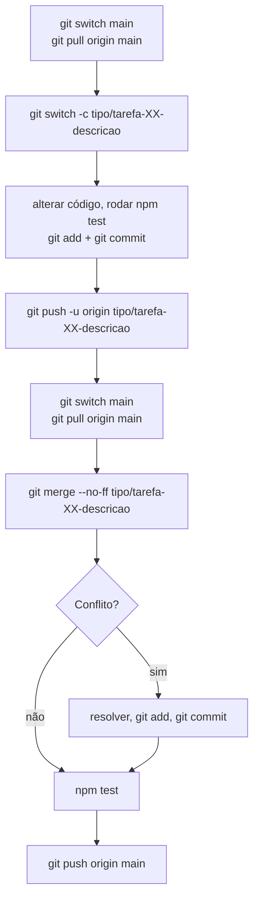

# Guia de contribuição

Este guia descreve **o padrão de trabalho deste repositório**. Seguir essas convenções é o que
está sendo avaliado (veja [Como vocês serão avaliados](README.md#como-vocês-serão-avaliados)).

> 💡 O próprio histórico do repositório segue este guia. Antes de começar, rode
> `git log --oneline --graph` e observe as branches, os merges e as mensagens de commit.

## Sumário

- [Configuração inicial](#configuração-inicial)
- [Fluxo de trabalho](#fluxo-de-trabalho)
- [Nomenclatura de branches](#nomenclatura-de-branches)
- [Conventional Commits](#conventional-commits)
- [Merge local com `--no-ff`](#merge-local-com---no-ff)
- [Resolvendo conflitos](#resolvendo-conflitos)
- [Push rejeitado](#push-rejeitado)
- [O que não fazer](#o-que-não-fazer)
- [Correções comuns](#correções-comuns)

---

## Configuração inicial

Cada integrante, **no seu computador**, depois de clonar o fork da equipe:

```bash
# Identificação dos commits: use o MESMO e-mail da sua conta do GitHub
git config user.name "Seu Nome Completo"
git config user.email "seu-email@exemplo.com"

# "git pull" passa a fazer merge (e não rebase) quando houver trabalho novo dos colegas
git config pull.rebase false

# Repositório base do professor
git remote add upstream https://github.com/wagnerloch/repo-aval-2026.git
```

> ⚠️ Em computadores compartilhados (laboratório), confira `git config user.name` e
> `git config user.email` **antes de cada commit**. Commits com o nome de outra pessoa
> contam como trabalho dessa pessoa.

---

## Fluxo de trabalho



1. Atualize a `main` local com o que os colegas já integraram.
2. Crie **uma branch por tarefa** a partir da `main` atualizada.
3. Faça as alterações em **commits pequenos**, no padrão Conventional Commits.
4. Envie a branch para o fork.
5. Volte para a `main`, atualize de novo e faça o **merge `--no-ff`** da sua branch.
6. Resolva os conflitos (se houver), rode os testes e envie a `main` para o fork.

---

## Nomenclatura de branches

```
<tipo>/tarefa-<número>-<descricao-curta>
```

- `tipo`: o tipo de Conventional Commits que melhor representa a tarefa (veja a tabela abaixo).
- `descricao-curta`: minúsculas, palavras separadas por hífen, sem acentos e sem espaços.
- Na TAREFA-01, que é feita por **cada** integrante, inclua o seu usuário do GitHub no final.

| ✅ Bom                                | ❌ Ruim               |
| ------------------------------------ | -------------------- |
| `docs/tarefa-01-maria-silva`          | `tarefa1`            |
| `feat/tarefa-99-exporta-relatorio`    | `Feat/Tarefa_99`     |
| `fix/tarefa-98-nota-vazia`            | `minha-branch`       |
| `test/tarefa-97-testes-da-cli`        | `joao`               |

---

## Conventional Commits

Especificação: <https://www.conventionalcommits.org/pt-br/v1.0.0/>

### Estrutura

```
<tipo>(escopo opcional): <descrição>

[corpo opcional: o quê e por quê]
```

Exemplo retirado do histórico deste repositório (veja com `git show 39c3302`):

```
fix(cli): exibe mensagem de uso quando as notas são inválidas

Sem notas ou com valores inválidos o programa encerrava com o stack trace
do erro, sem indicar ao usuário como utilizá-lo. Agora o erro é tratado,
uma mensagem de uso é exibida e o processo termina com código 1.
```

### Tipos

| Tipo       | Quando usar                                                     | Exemplo                                                   |
| ---------- | --------------------------------------------------------------- | --------------------------------------------------------- |
| `feat`     | Nova funcionalidade para quem usa o sistema                     | `feat(cli): permite calcular a média pela linha de comando` |
| `fix`      | Correção de um defeito                                          | `fix(cli): exibe mensagem de uso quando as notas são inválidas` |
| `test`     | Somente testes (novos ou ajustados)                             | `test(media): adiciona testes do cálculo da média`        |
| `refactor` | Melhoria no código **sem** mudar o comportamento                | `refactor(cli): extrai a mensagem de uso para uma constante` |
| `docs`     | Somente documentação (README, CHANGELOG, comentários)           | `docs: adiciona changelog da versão 1.0.0`                |
| `style`    | Formatação (espaços, aspas, indentação), sem mudar lógica       | `style: padroniza a indentação dos testes`                |
| `chore`    | Manutenção que não se encaixa nos demais (versão, configurações)| `chore: ignora a pasta coverage no git`                   |
| `ci`       | Integração contínua (GitHub Actions)                            | `ci: adiciona workflow de testes`                         |
| `build`    | Dependências e empacotamento                                    | `build: adiciona dependência para leitura de arquivos`    |
| `perf`     | Melhoria de desempenho                                          | `perf(media): evita percorrer as notas duas vezes`        |
| `revert`   | Desfaz um commit anterior                                       | `revert: feat(cli): permite calcular a média pela linha de comando` |

**Escopos sugeridos:** `media`, `cli`, `config`, `release`. O escopo é opcional.

### Regras

- Tipo e escopo em **letras minúsculas**, seguidos de `: ` (dois-pontos e **um** espaço).
- Descrição curta, no presente, começando com letra minúscula: _"adiciona"_, _"corrige"_, _"remove"_.
- **Sem ponto final** no cabeçalho, com no máximo 100 caracteres.
- Se precisar de corpo, deixe **uma linha em branco** depois do cabeçalho.
- **Um commit = uma mudança lógica.** Se a descrição precisa de "e" para juntar assuntos diferentes, provavelmente são dois commits.

| ✅ Bom                                                   | ❌ Ruim                   |
| ------------------------------------------------------- | ------------------------ |
| `test(media): adiciona testes do cálculo da média`       | `testes`                 |
| `docs: corrige link quebrado no readme`                  | `update README.md`       |
| `fix(cli): exibe mensagem de uso quando as notas são inválidas` | `Fix: arrumei o bug.` |
| `refactor(cli): extrai a mensagem de uso para uma constante` | `ajustes finais`     |

### Conferindo os commits

```bash
npm run lint:commits
```

Mostra quais dos seus commits (que ainda não estão no repositório base) estão fora do padrão.
No Pull Request, o GitHub Actions faz a mesma verificação. Commits fora do padrão **não impedem a
entrega**, mas descontam pontos.

---

## Merge local com `--no-ff`

```bash
git switch main
git pull origin main                     # traz o trabalho que os colegas já enviaram
git merge --no-ff tipo/tarefa-XX-descricao
npm test
git push origin main
```

- O `--no-ff` **sempre** cria um commit de merge. Assim o histórico mostra que o trabalho foi feito
  em uma branch. Sem ele, o Git pode fazer _fast-forward_ e os commits aparecem como se tivessem sido
  feitos direto na `main`.
- **Mantenha a mensagem padrão** do merge (`Merge branch 'tipo/tarefa-XX-descricao'`).
- Rode `npm test` **depois** do merge: a junção de duas alterações corretas pode quebrar algo.

Com vários integrantes trabalhando ao mesmo tempo, o histórico fica parecido com este
(saída de `git log --graph --format=%s`):

```
*   Merge branch 'fix/tarefa-98-nota-vazia'
|\
| * fix(cli): trata nota vazia
* |   Merge branch 'docs/tarefa-01-joao-souza'
|\ \
| |/
|/|
| * docs: adiciona joão souza à equipe
* |   Merge branch 'docs/tarefa-01-maria-silva'
|\ \
| |/
|/|
| * docs: adiciona maria silva à equipe
|/
*   Merge branch 'docs/instrucoes-avaliacao'
```

Commits como `Merge branch 'main' of https://github.com/...`, criados pelo `git pull`, também são normais.

---

## Resolvendo conflitos

Um conflito acontece quando duas pessoas alteram **as mesmas linhas** de um arquivo. Exemplo: Maria e
João adicionaram seus nomes na tabela da equipe, cada um na sua branch. A branch da Maria já está na
`main`; ao fazer o merge da branch do João, o Git mostra:

```
CONFLICT (content): Merge conflict in README.md
Automatic merge failed; fix conflicts and then commit the result.
```

No `README.md` aparecem os marcadores:

```
| Nome | Usuário do GitHub |
| ---- | ----------------- |
<<<<<<< HEAD
| Maria Silva | @mariasilva |
=======
| João Souza | @joaosouza |
>>>>>>> docs/tarefa-01-joao-souza
```

- Entre `<<<<<<< HEAD` e `=======`: o que já está na `main`.
- Entre `=======` e `>>>>>>>`: o que vem da branch que está sendo mesclada.

A resolução correta, neste caso, **mantém as duas linhas** e remove os marcadores:

```
| Nome | Usuário do GitHub |
| ---- | ----------------- |
| Maria Silva | @mariasilva |
| João Souza | @joaosouza |
```

Depois:

```bash
git status                  # confere se ainda há arquivos em conflito
npm test
git add README.md
git commit                  # conclui o merge (mantenha a mensagem padrão)
git push origin main
```

- Para desistir do merge e voltar ao estado anterior: `git merge --abort`.
- Antes do commit, procure marcadores esquecidos: `git diff --check`.
- **Nunca** resolva um conflito apagando o trabalho do colega sem conversar com ele.

---

## Push rejeitado

```
! [rejected]        main -> main (fetch first)
```

Significa que um colega enviou commits para a `main` depois do seu último `pull`. **Não use `--force`.**

```bash
git pull origin main        # traz os commits do colega (pode gerar conflito)
npm test
git push origin main
```

Se aparecer `fatal: Need to specify how to reconcile divergent branches`, rode
`git config pull.rebase false` e repita o `git pull`.

---

## O que não fazer

- ❌ Commitar diretamente na `main` (nela só devem entrar commits de merge).
- ❌ `git push --force` na `main`: isso **apaga o trabalho dos colegas** no fork.
- ❌ Reescrever commits que já foram enviados (`rebase`, `commit --amend` seguido de push forçado).
- ❌ Mensagens genéricas: `update`, `ajustes`, `wip`, `commit final`, `agora vai`.
- ❌ Um único commit com várias tarefas.
- ❌ Fazer o commit no computador de um colega com o nome dele configurado.

---

## Correções comuns

| Situação                                                        | O que fazer                                                        |
| --------------------------------------------------------------- | ------------------------------------------------------------------ |
| Ver o histórico com as branches                                 | `git log --oneline --graph --all`                                  |
| Mensagem do **último** commit errada (ainda **não** enviado)    | `git commit --amend -m "tipo(escopo): descrição correta"`          |
| Esqueci um arquivo no último commit (ainda **não** enviado)     | `git add arquivo` e `git commit --amend --no-edit`                 |
| Commitei na `main` por engano (1 commit, ainda **não** enviado) | `git branch tipo/tarefa-XX-descricao`, `git reset --hard HEAD~1` e `git switch tipo/tarefa-XX-descricao` |
| Preciso trocar de branch, mas tenho alterações não commitadas    | `git stash`, troque de branch e depois `git stash pop`             |
| O commit **já foi enviado** com mensagem errada                 | Não reescreva: siga em frente e explique no Pull Request           |
| Desfazer um commit que já foi enviado                           | `git revert <hash>`                                                |

> ⚠️ `git reset --hard` descarta alterações **não commitadas**. Rode `git status` antes.
